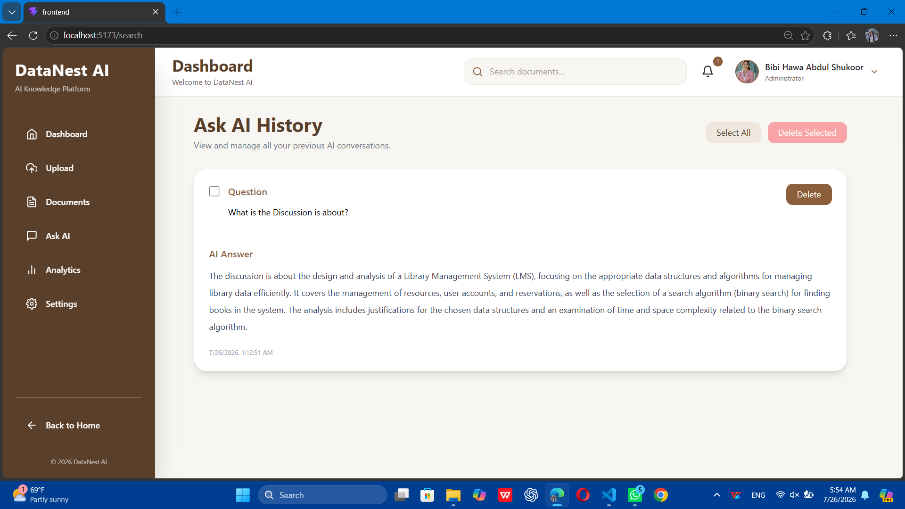

# 📚 DataNest AI

An AI-powered Knowledge Management Platform built with **React**, **Supabase**, and **OpenRouter AI**.

DataNest AI allows users to upload documents, manage their knowledge base, and ask AI questions using Retrieval-Augmented Generation (RAG). The project also includes a modern landing page for introducing the platform before entering the dashboard.

---

# 🚀 Features

## Home Page

- Modern responsive homepage
- Beautiful hero section
- Project introduction
- Features overview
- Smooth navigation
- Call-to-Action buttons
- Responsive design

## Dashboard

- Overview of uploaded documents
- Indexed chunks statistics
- AI questions statistics
- Quick access cards

## Upload

- Upload PDF files
- Upload DOCX files
- Upload TXT files
- Automatic text extraction

## Documents

- View uploaded documents
- Search documents
- Delete documents
- Document summaries

## Ask AI

- Ask questions about uploaded documents
- Semantic Search
- Retrieval-Augmented Generation (RAG)
- AI-generated answers using OpenRouter

## Analytics

- Documents statistics
- AI usage statistics
- System health
- Recent uploads
- Knowledge Base monitoring

## Settings

- Administrator profile
- Connected services
- Export Questions
- Export Documents
- Clear AI History
- Reset Application

## Upcoming Features

- 🌙 Dark Mode
- User Authentication
- Chat History
- Favorites
- Workspace Support

---

# 🛠️ Technologies

### Frontend

- React
- React Router DOM
- Tailwind CSS
- Axios
- React Icons

### Backend

- Supabase
- PostgreSQL
- pgvector

### AI

- OpenRouter API
- GPT-4o Mini

### Libraries

- pdfjs-dist
- mammoth

---

# 📂 Project Structure

```
src/
│
├── Components/
├── Pages/
│   ├── Landing
│   ├── Dashboard
│   ├── Upload
│   ├── Documents
│   ├── AskAI
│   ├── Analytics
│   └── Settings
│
├── Services/
│   ├── supabase.js
│   ├── openrouter.js
│   └── extractText.js
│
└── App.jsx
```

---

# 📷 Screenshots

## Home Page


## Dashboard


## Upload Documents


## Documents


## Ask AI


## Ask AI History



## Analytics


## Settings


## Dark Mode _(Coming Soon)_


---

# 📖 Workflow

1. User visits the Landing Page.
2. User enters the Dashboard.
3. Uploads documents.
4. Text is extracted automatically.
5. Documents are split into chunks.
6. Chunks are stored in Supabase.
7. Relevant chunks are retrieved.
8. Context is sent to OpenRouter GPT-4o Mini.
9. AI returns an answer based on the uploaded knowledge base.

---

## 🔐 Environment Variables

Create a `.env` file in the project root and add:

```env
VITE_SUPABASE_URL=your_supabase_url

VITE_SUPABASE_ANON_KEY=your_supabase_anon_key

VITE_OPENROUTER_API_KEY=your_openrouter_api_key
```

# 🔮 Future Improvements

- Dark Mode
- Authentication
- User Accounts
- Chat History
- Delete Individual Chunks
- Favorite Documents
- Better Analytics
- Export Conversations
- Mobile Optimization

---

# 👩‍💻 Developer

**Bibi Hawa Abdul Shukoor**

Computer Science Student

Built with ❤️ using React, Tailwind CSS, Supabase and OpenRouter AI.

---

# 📄 License

This project was developed for educational purposes.
