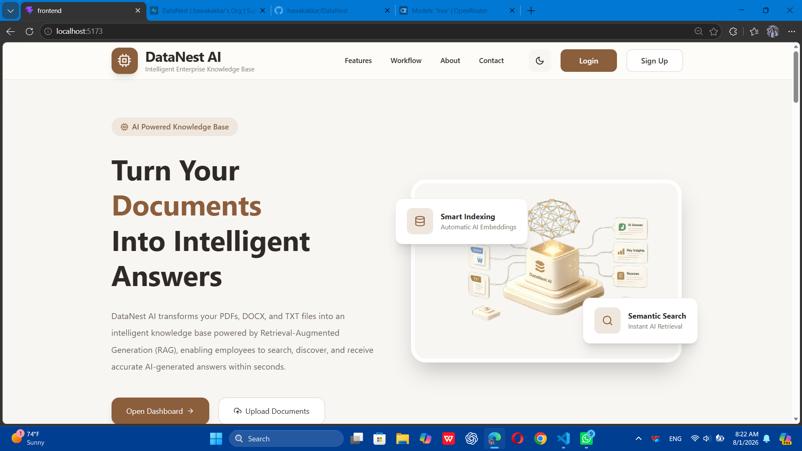
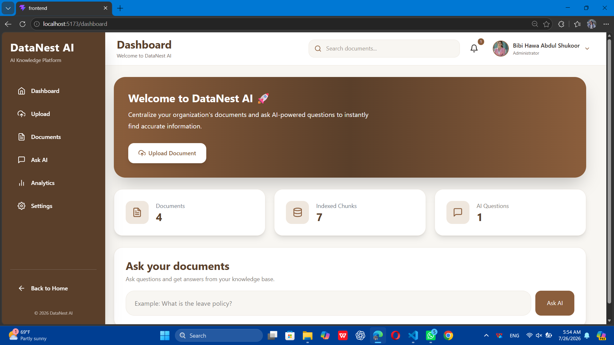
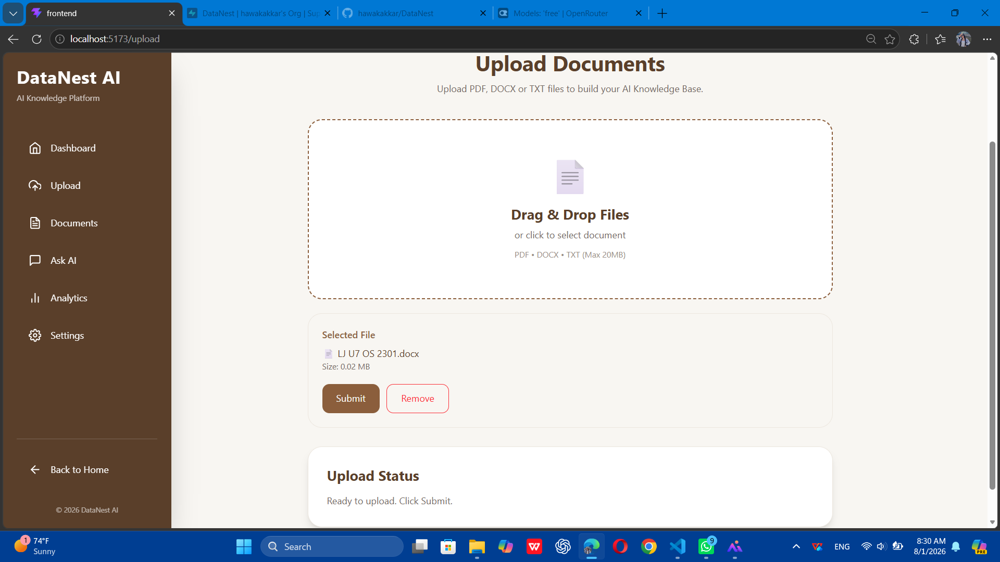
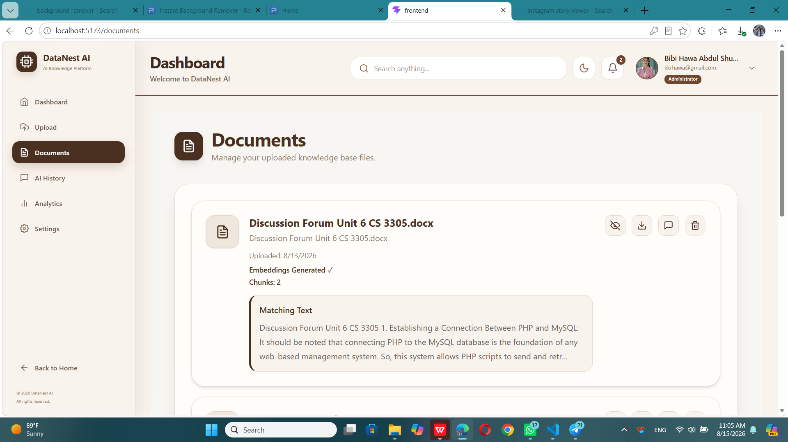
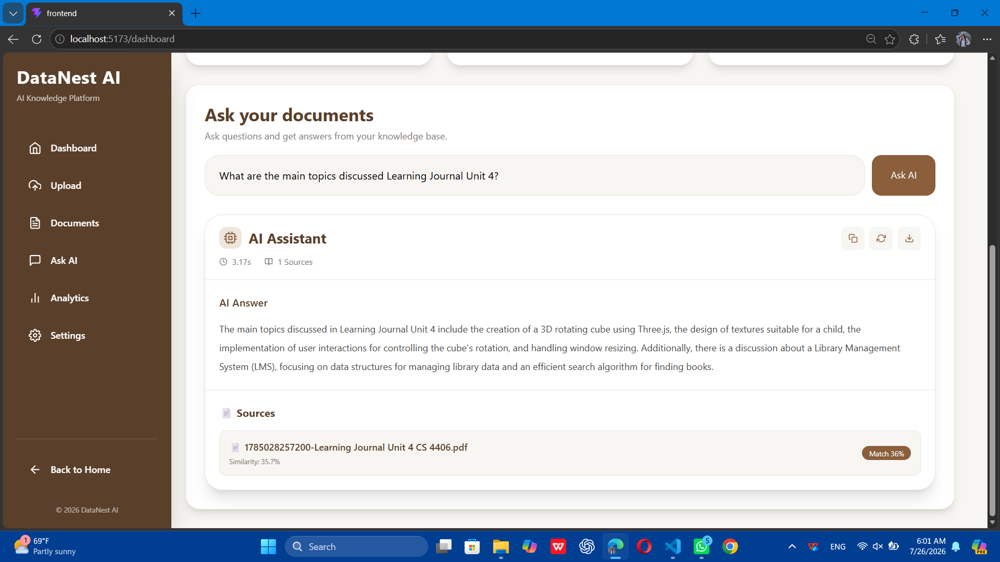
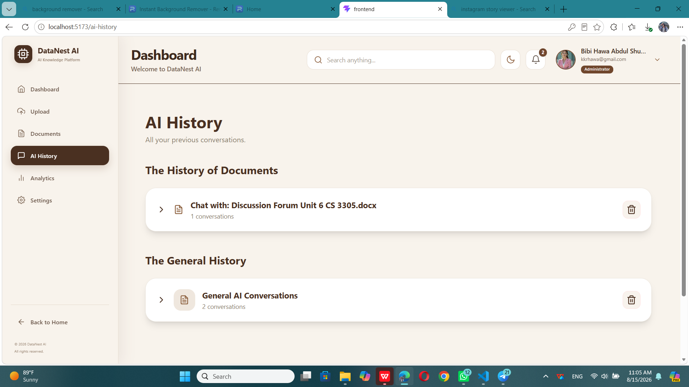
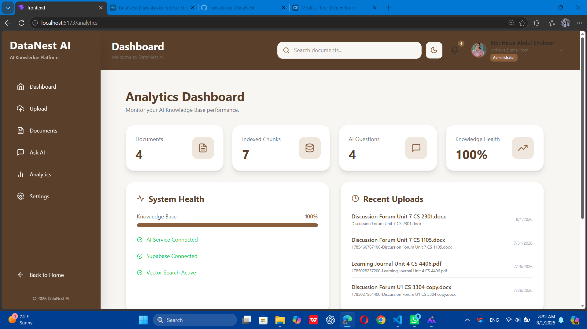
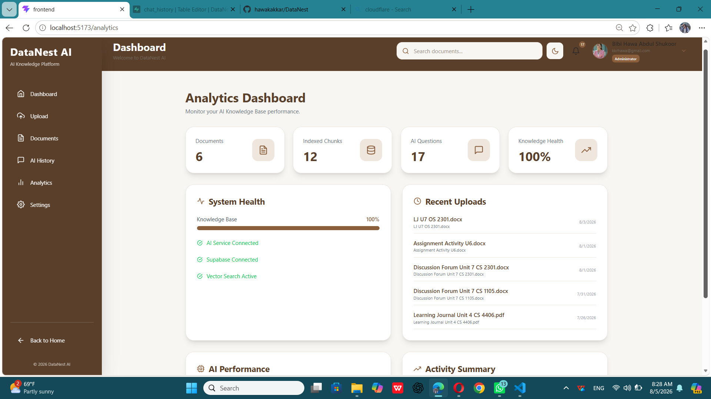
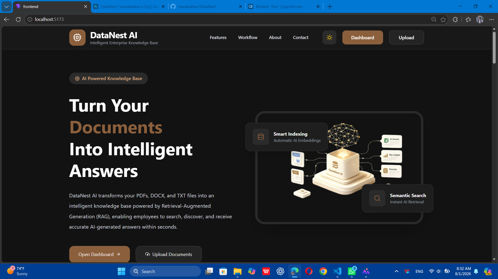

# 📚 DataNest AI

An AI-powered Knowledge Management Platform built with **React**, **Supabase**, and **OpenRouter AI**.

DataNest AI allows users to upload documents, build a searchable knowledge base, and ask AI-powered questions using Retrieval-Augmented Generation (RAG).

The platform provides document management, semantic search, AI answers, analytics, and system monitoring through a modern responsive interface.

---

# 🚀 Features

## 🏠 Home Page

- Modern responsive landing page
- Hero section with project introduction
- Features overview
- Smooth navigation
- Call-to-Action buttons
- Responsive design

---

## 📊 Dashboard

- Overview of uploaded documents
- Indexed chunks statistics
- AI questions statistics
- Quick access cards
- Knowledge base overview

---

## 📤 Upload Documents

- Upload PDF files
- Upload DOCX files
- Upload TXT files
- Drag and drop support
- File selection before uploading
- Submit and Remove controls
- Automatic text extraction
- Document size validation
- Duplicate filename detection
- Text chunk generation
- Vector embedding creation

---

## 📄 Documents

- View uploaded documents
- Search documents
- Delete documents
- Document summaries
- Document management

---

## 🤖 Ask AI

- Ask questions from uploaded documents
- Semantic search
- Retrieval-Augmented Generation (RAG)
- Context-based AI answers
- OpenRouter AI integration
- Source document reference
- Answer copy functionality
- Regenerate answers
- Download answers
- Question history storage

---

## 📈 Analytics

- Documents statistics
- Indexed chunks monitoring
- AI questions statistics
- System health monitoring
- Recent uploads
- Knowledge base status
- AI performance information

---

## ⚙️ Settings

- Administrator profile
- Connected services status
- Export questions
- Export documents
- Clear AI history
- Reset application data
- Theme settings

---

## 🌙 User Interface

- Modern UI design
- Responsive layout
- Light mode
- Dark mode support
- Smooth transitions
- Tailwind CSS styling

---

# 🛠️ Technologies

## Frontend

- React
- React Router DOM
- Tailwind CSS
- Axios
- React Icons

## Backend

- Supabase
- PostgreSQL
- pgvector
- Supabase Storage

## AI

- OpenRouter API
- NVIDIA Nemotron AI Model
- Retrieval-Augmented Generation (RAG)

## Document Processing

- pdfjs-dist
- mammoth

---

# 📂 Project Structure

```
src/
│
├── components/
│   ├── DocumentCard.jsx
│   ├── Header.jsx
│   └── Sidebar.jsx
│
├── pages/
│   ├── Home
│   ├── Dashboard
│   ├── Upload
│   ├── Documents
│   ├── AskAI
│   ├── Analytics
│   ├── Profile
│   ├── Register
│   ├── Login
│   ├── Search
│   └── Settings
│
├── Services/
│   ├── supabase.js
│   └── openrouter.js
│
├── utils/
│   ├── extractText.js
│   ├── chunkText.js
│   ├── searchChunks.js
├   ├── createEmbeddings.js
│   └── askAI.js
│
└── App.jsx
```

---

# 📷 Screenshots

## Home Page



## Dashboard



## Upload Documents



## Documents



## Ask AI



## Ask AI History



## Analytics



## Settings



## Dark Mode _(Coming Soon)_



---

---

# 📖 Workflow

1. User enters the platform through the Landing Page.
2. User uploads a document.
3. The system extracts text automatically.
4. Extracted text is divided into smaller chunks.
5. Chunks are converted into vector embeddings.
6. Data is stored in Supabase PostgreSQL with pgvector.
7. User asks a question.
8. Semantic search finds relevant document chunks.
9. Context is sent to OpenRouter AI.
10. AI generates an answer based only on the uploaded documents.

---

# 🔐 Environment Variables

Create a `.env` file in the project root:

```env
VITE_SUPABASE_URL=your_supabase_url

VITE_SUPABASE_ANON_KEY=your_supabase_anon_key

VITE_OPENROUTER_API_KEY=your_openrouter_api_key

```

# 👩‍💻 Developer

**Bibi Hawa Abdul Shukoor**

Computer Science Student

Built with ❤️ using React, Tailwind CSS, Supabase and OpenRouter AI.

---

# 📄 License

This project was developed for educational purposes.
